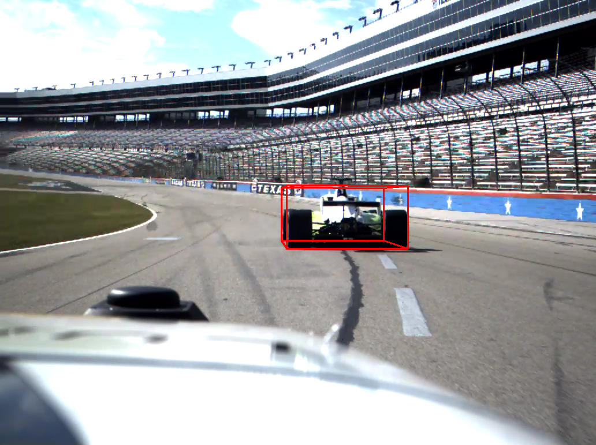

# **Monocular Camera-Based Object Detection and 6D Pose Estimation for Autonomous Racing**



This repository provides an accurate and cost-effective 3D object detection method for car racing scenarios using monocular images. The algorithm lifts 3D bounding boxes from the [YOLOv5](https://github.com/ultralytics/yolov5) 2D detections and estimates the target's 6D pose in 3D space. The proposed method has been tested on image data captured at distances ranging from 10 to 55 meters, demonstrating highly competitive accuracy compared to state-of-the-art LiDAR PointRCNN detection, while offering the advantages of low computational requirements and real-time performance.

## **Requirements**

- Python 3.8
- Linux Ubuntu 20.04 (for ROS version)
- ROS2 Galactic (for ROS version)

## **Installation**
### **Python Version**
Install dependencies:
```
cd camera3d_py
pip install -r requirements.txt
```

### **ROS2 Version**
Install dependencies:
```
sudo apt update
sudo apt install python3-pip ros-galactic-vision-msgs
pip install yolov5
```

## **Usage**
### **Python Version**
Configurations:
- Inference arguments: `camera3d_py/config/config_inference.ini`
- Pretrained models: `camera3d_py/models`
- Camera parameters: `camera3d_py/config/config_camera.ini`
- Bounding box geometry: `camera3d_py/config/config_bbox.ini`

Run commands:
```
cd camera3d_py
python3 camera3d.py
```

### **ROS2 Version**
Configurations:
- ROS topics: `camera3d_ros/config/config_ros.ini`
- Inference arguments: `camera3d_ros/config/config_inference.ini`
- Pretrained models: `camera3d_ros/config`
- Camera parameters: `camera3d_ros/config/camera_info.yaml`
- Bounding box geometry: `camera3d_ros/config/config_bbox.ini`

Run commands:
```
cd camera3d_ros
colcon build
source install/setup.bash
ros2 run yolov5_ros2 yolo_detect_3d
```

## **Contributions**
[1] Wang, J-H., Ziegler, D., Lienkamp, M. (2023). *Monocular Camera-Based Object Detection and 6D Pose Estimation for Autonomous Racing* [Master's Thesis, Technical University of Munich]

----

### Contact: [Jen-Hung Wang](jenhung.wang@tum.de)
